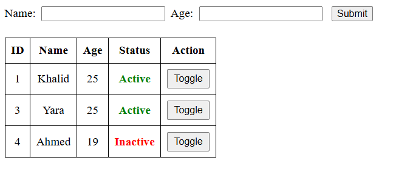
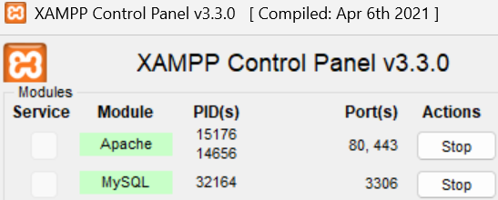
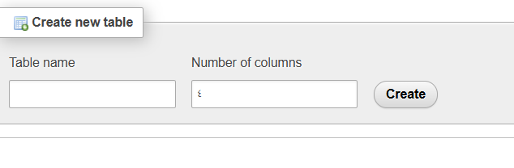

# 🧠 PHP Status Toggle Form

This is a simple web project using PHP and MySQL. It allows you to:
- Submit name and age through a form.
- Save the data to a MySQL database.
- Display all records in a table.
- Toggle the status (0 or 1) of each record using a button.
 
---

## ✅ Step 1: Install XAMPP

- Open XAMPP Control Panel.
- Start the following services:
  - ✅ Apache
  - ✅ MySQL
 
---

## ✅ Step 2: Open phpMyAdmin


- - Click **"New"** on the left to create a new database.

 

---

## ✅ Step 3: Name the Database

- Enter a name for your database, e.g., `info`, and click **Create**.

 

---

## ✅ Step 4: Create a Table

- Inside your database, create a new table named `status`.
- Set the number of columns to **4**.

 

### Table Columns:

| Column | Type      | Description                      |
|--------|-----------|----------------------------------|
| ID     | INT       | AUTO_INCREMENT, PRIMARY KEY      |
| Name   | VARCHAR(15) | NOT NULL                       |
| Age    | INT       | NOT NULL                         |
| Status | INT       | DEFAULT 0                        |

---

##  ✅ Step 5: PHP Code

Create a file named `index.php` and save it in:

C:\xampp\htdocs\info\index.php


```php
<?php
$conn = new mysqli("localhost", "root", "", "info");
if ($conn->connect_error) die("Connection failed: " . $conn->connect_error);

if (isset($_POST['submit'])) {
    $name = $_POST['name'];
    $age = $_POST['age'];
    $conn->query("INSERT INTO status (Name, Age) VALUES ('$name', $age)");
}

if (isset($_GET['toggle'])) {
    $id = $_GET['toggle'];
    $result = $conn->query("SELECT Status FROM status WHERE ID = $id");
    $row = $result->fetch_assoc();
    $newStatus = $row['Status'] == 1 ? 0 : 1;
    $conn->query("UPDATE status SET Status = $newStatus WHERE ID = $id");
    header("Location: index.php");
    exit();
}
?>
<!DOCTYPE html>
<html>
<head>
    <title>Status Toggle</title>
    <style>
        table, th, td { border: 1px solid black; padding: 8px; }
        input { margin: 4px; }
    </style>
</head>
<body>
    <form method="POST">
        Name: <input type="text" name="name" required>
        Age: <input type="number" name="age" required>
        <input type="submit" name="submit" value="Submit">
    </form>
    <br>
    <table>
        <tr><th>ID</th><th>Name</th><th>Age</th><th>Status</th><th>Action</th></tr>
        <?php
        $result = $conn->query("SELECT * FROM status");
        while ($row = $result->fetch_assoc()) {
            $color = $row['Status'] == 1 ? 'green' : 'red';
            $text = $row['Status'] == 1 ? 'Active' : 'Inactive';
            echo "<tr>
                <td>{$row['ID']}</td>
                <td>{$row['Name']}</td>
                <td>{$row['Age']}</td>
                <td style='color:$color; font-weight:bold;'>$text</td>
                <td><a href='index.php?toggle={$row['ID']}'><button type='button'>Toggle</button></a></td>
            </tr>";
        }
        ?>
    </table>
</body>
</html>
```
## ✅ Step 6: Run the Project in Browser 

http://localhost/info/index.php

after that you should see this :
 
